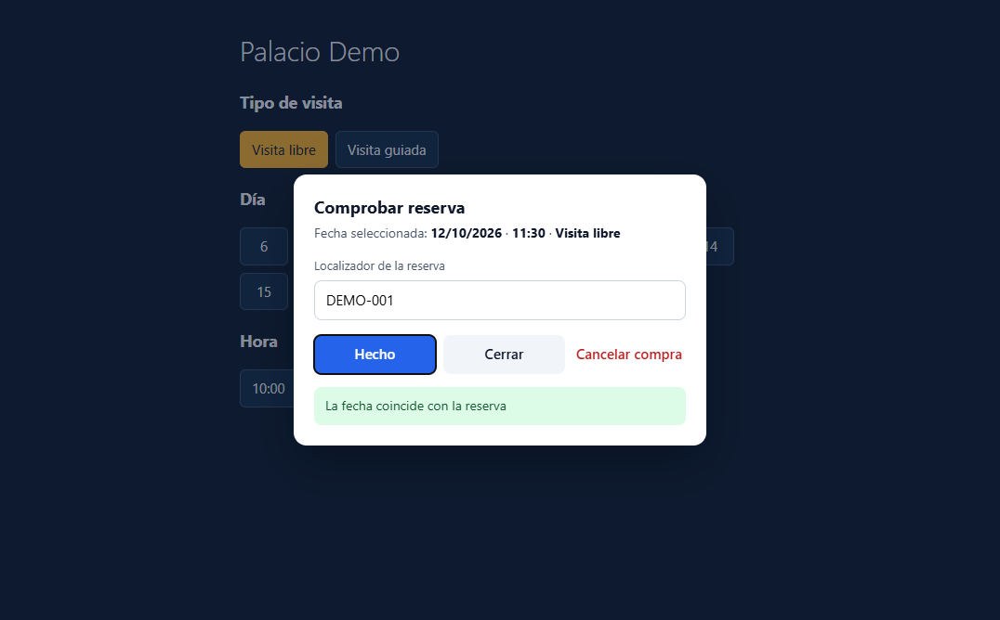
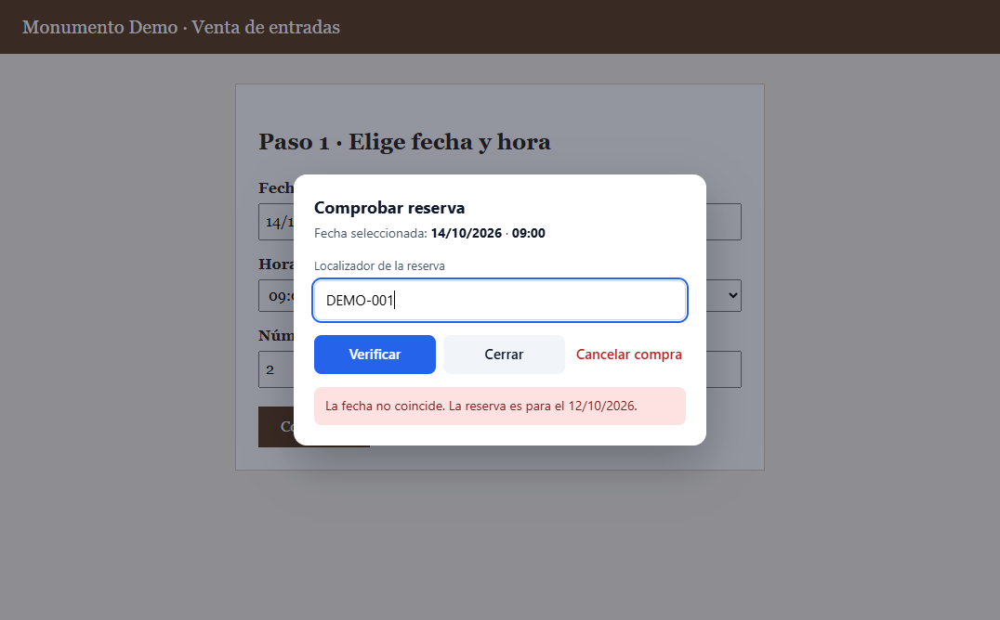
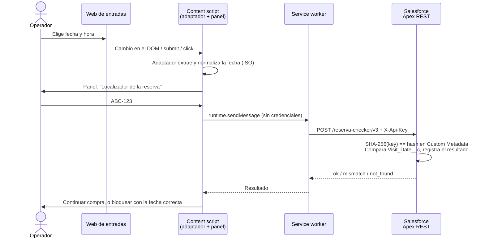

# Reserva Checker

Extensión de **Chrome (Manifest V3)** con un **endpoint Apex REST** en Salesforce. Evita un error caro en la operativa de una agencia de turismo: **comprar entradas para una fecha que no es la de la reserva del cliente**.

Cuando el operador elige fecha y hora en la web oficial de venta de entradas, la extensión intercepta el paso, le pide el localizador y lo valida contra el CRM **antes** de pagar. Si la fecha no coincide, el operador no puede continuar.

   

| Fecha correcta | Fecha equivocada |
|---|---|
|  |  |

> Usada en producción por el equipo de operaciones en 10 webs de venta de entradas de monumentos. Esta es la **v3**, reescrita para su publicación: sin marcas, sin credenciales y con adaptadores de demostración en lugar de los de producción.

## Cómo funciona



### Adaptadores: una web nueva sin escribir código

Cada web de entradas muestra la fecha a su manera. En vez de un script por web, hay **tres estrategias genéricas** que se configuran con selectores ([`extension/content/adapters.js`](extension/content/adapters.js)):

| Estrategia | Cuándo | Cómo |
|---|---|---|
| `formSubmit` | Formularios clásicos (ASP.NET WebForms…) | Intercepta el submit en fase de captura, lee los inputs y reenvía el formulario (`requestSubmit`) tras verificar. |
| `selectionWatch` | SPAs (Angular, React…) | `MutationObserver` sobre clases y `aria-*`. Se dispara cuando cambia la combinación fecha + hora (+ producto). |
| `slotClick` | Listados de sesiones | Delegación de eventos: la hora sale del botón y la fecha de su contenedor. |

```js
{
  id: 'demo-calendar',
  match: { hosts: ['localhost'], pathIncludes: '/demo/calendar' },
  strategy: 'selectionWatch',
  date: { selector: '.cal-day[aria-selected="true"]', attr: 'aria-label' }, // "30-4-2026"
  time: { selector: '.slot.is-selected', attr: 'aria-label' },
}
```

El normalizador de fechas ([`extension/lib/date.js`](extension/lib/date.js)) entiende `30/04/2026`, `30-4-2026`, `2026-04-30`, rangos, `jueves, 15 de octubre de 2026`, `October 15, 2026`… y rechaza fechas imposibles como el 31 de febrero.

## Seguridad

- **La API key no está en el código.** Se configura en la página de Opciones y se guarda en `chrome.storage.local`. Solo el service worker la lee. La web visitada nunca la ve, y el test e2e lo comprueba.
- **En Salesforce no se guarda la clave**, solo su SHA-256, en un Custom Metadata *Protected*.
- **Permisos mínimos.** El content script se inyecta solo en las webs con adaptador. El permiso de red se pide **en tiempo de ejecución** y únicamente para el origen del endpoint configurado (`optional_host_permissions`).
- **Panel en Shadow DOM cerrado.** La web anfitriona no puede leerlo ni alterarlo, y sus estilos no lo rompen.
- **Validación en ambos extremos.** El localizador se comprueba con lista blanca de caracteres, la fecha tiene que ser ISO válida, y la consulta SOQL usa bind variables.

## Estructura

```
extension/
  manifest.json          MV3
  background.js          Service worker: único que conoce la API key
  content/adapters.js    Estrategias + registro de adaptadores
  content/main.js        Panel de verificación (Shadow DOM)
  lib/date.js            Normalización de fechas y horas
  lib/api.js             Contrato con el backend (validación, request, respuesta)
  options/  popup/  icons/
salesforce/              Proyecto SFDX
  classes/ReservaCheckerApi.cls       Endpoint REST
  classes/ReservaCheckerApiTest.cls   Tests Apex
  objects/Booking__c/                 Campos que usa el endpoint
  objects/Reserva_Checker_Setting__mdt/  Hash de la API key
demo/                    Webs de entradas ficticias + API mock (Node, sin dependencias)
test/                    Tests unitarios (node:test)
e2e/                     Carga la extensión en Chromium headless y la maneja por CDP
```

## Probarlo en 2 minutos

```bash
npm run demo        # http://localhost:8787/demo/  (API key: demo-key)
```

1. En `chrome://extensions`, activa el modo desarrollador y pulsa **Cargar descomprimida** → carpeta `extension/`.
2. En **Opciones** de la extensión, pon como endpoint `http://localhost:8787/api/reserva-checker/v3` y como API key `demo-key`.
3. Abre cualquiera de las tres webs demo y elige fecha y hora. Las reservas de prueba son `DEMO-001` (hoy + 7 días) y `DEMO-002` (hoy + 14 días).

## Tests

```bash
npm test            # unitarios: fechas, contrato de la API, API mock
npm run test:e2e    # extensión real en Edge/Chromium headless (BROWSER_PATH para otro navegador)
```

El e2e recorre las tres estrategias:

- verificación correcta y reenvío del formulario;
- fecha errónea que bloquea la compra;
- fecha textual en español;
- aislamiento de la API key y del panel.

Los tests Apex cubren las respuestas correcta, de fecha distinta, de cancelación, 401, 404 y 400 (con un intento de inyección SOQL).

## Despliegue en Salesforce

```bash
cd salesforce
sf project deploy start --target-org <alias> --test-level RunSpecifiedTests --tests ReservaCheckerApiTest
```

Después:

1. Crea el registro `Reserva_Checker_Setting__mdt.Default` con `Api_Key_Hash__c` igual al SHA-256 de tu clave:
   ```bash
   node -e "console.log(require('crypto').createHash('sha256').update(process.argv[1]).digest('hex'))" 'tu-clave'
   ```
2. Expón la clase en un **Salesforce Site** y da acceso a `ReservaCheckerApi` en el perfil del usuario invitado. El endpoint queda en `https://<site>/services/apexrest/reserva-checker/v3`.

## Evolución del proyecto

| Versión | Hito |
|---|---|
| 1.x | Prueba de concepto en una web: popup en el paso de confirmación, endpoint Apex y registro de cancelaciones. |
| 1.6–1.7 | Autenticación del endpoint con credenciales en cabecera. |
| 2.0–2.1 | Multi-sitio: se pasa de 1 a 10 webs (formularios ASP.NET, SPAs Angular y listados de sesiones). |
| **3.0** | **Reescritura**: adaptadores declarativos en lugar de código duplicado por web, credenciales fuera del código (Opciones + hash en Custom Metadata), permisos mínimos, Shadow DOM, y tests unitarios, e2e y Apex. |

La v2 creció añadiendo una copia de la lógica por cada web nueva. La v3 resuelve las causas: una web nueva es **un objeto de configuración**, y la seguridad no depende de ofuscar el código.

## Licencia

[MIT](LICENSE)
